# C# Selection Exercises

## Exercise 1

Input two numbers and calculate the difference between them.    
Always subtract the smaller number from the larger one.     
Create a program to read these two numbers, calculate the difference, and print it.

### Situation 1:

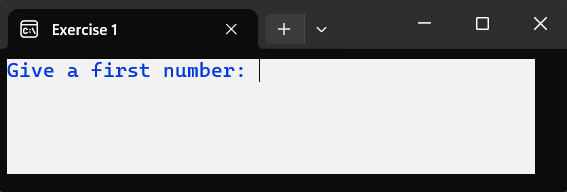
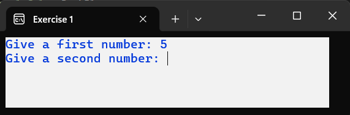
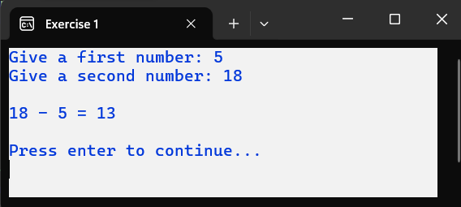

### Situation 2:

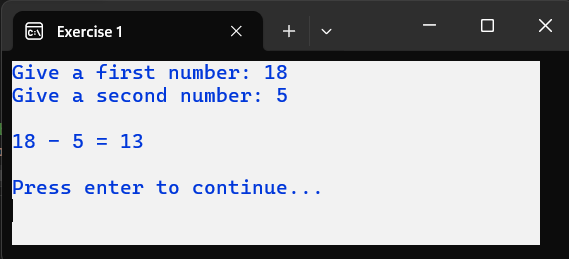

## Exercise 2

Read two numbers and divide the first number by the second.     
Handle division by zero properly.   
If division by zero is attempted, print the first number along with the message "cannot be divided by 0".

### Situation 1:

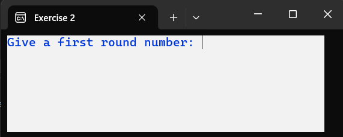
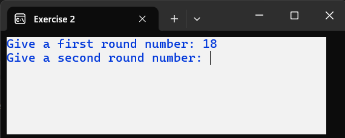
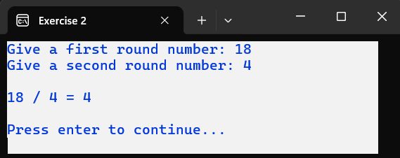

### Situation 2:

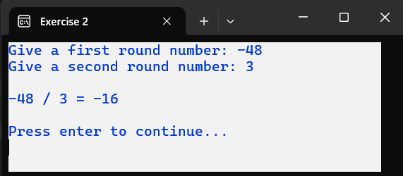

### Situation 3:

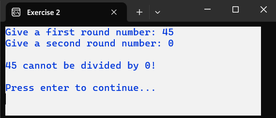

## Exercise 3

Read the first name, last name, and age.     
Determine the age group.    
Someone is in the 'Youth' age group if they are younger than 18; otherwise, they are in the 'Adults' age group.     
Constraint: Do not use an Else statement in the solution.

**Additional Colors:**
- The first and last names are printed in red when the age is requested.
- The age group 'Youth' is printed in dark green.

### Situation 1:

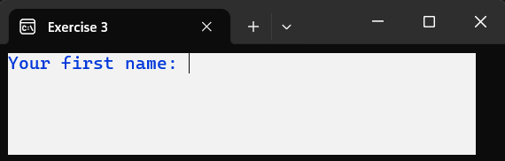
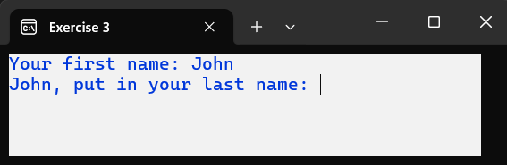
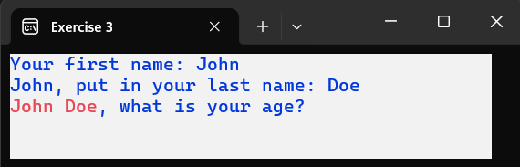
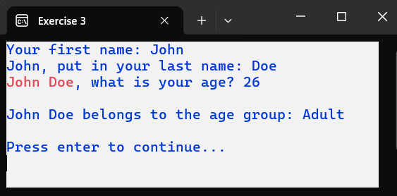

### Situation 2:

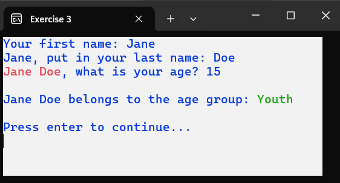

## Exercise 4

Read three integers, one letter code ('A' or 'B'), and one digit code ('1', '2', or '3').   
The combination of the letter code and the digit code determines which operation should be performed.   
Refer to the table below to find the correct operation.

| Digit Code '1' | Digit Code '2' | Digit Code '3' |
| -------------- | -------------- | -------------- |
| Letter Code 'A' | Number 1 + Number 2 | Number 2 + Number 3 | Number 1 + Number 3 |
| Letter Code 'B' | Number 1 - Number 2 | Number 2 - Number 3 | Number 1 - Number 3 |

### Situation 1:

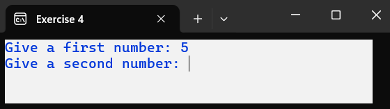
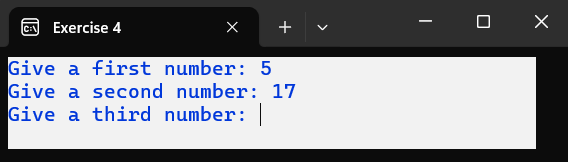
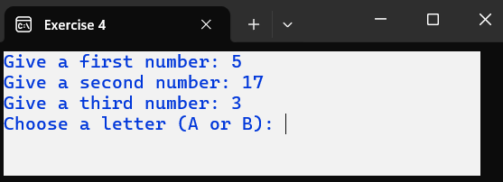
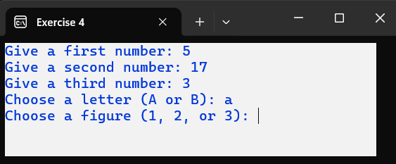
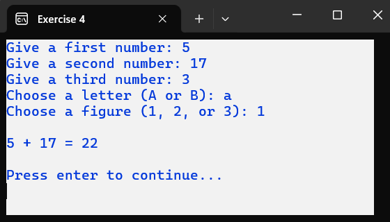

### Situation 2:

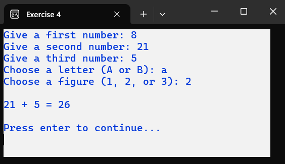

### Situation 3:

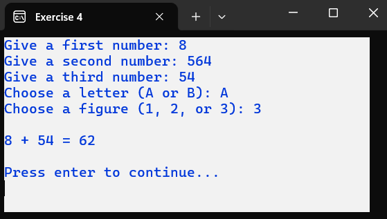

### Situation 4:

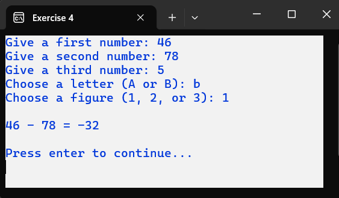

### Situation 5:

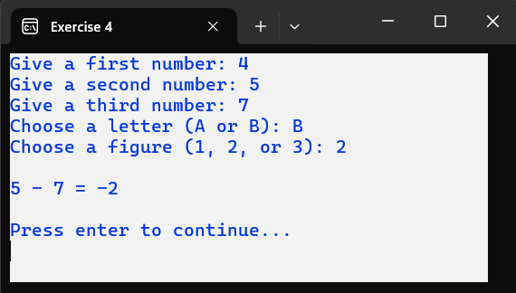

### Situation 6:

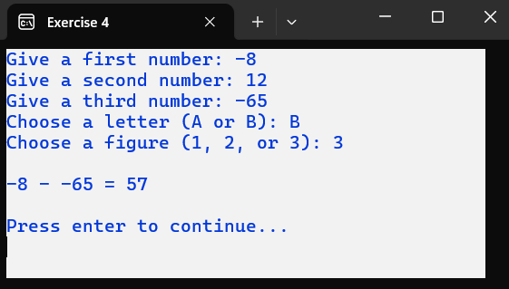

## Exercise 5

Calculate the points after throwing a dart at a dartboard.  
Based on where the dart lands, print the corresponding points.

- Outside the bullseye: 0 points – landing place = 1
- Outer ring: 20 points – landing place = 2
- Inner ring: 50 points – landing place = 3
- In the center: 100 points – landing place = 4

### Situation 1:

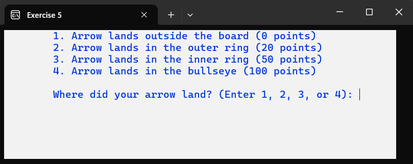
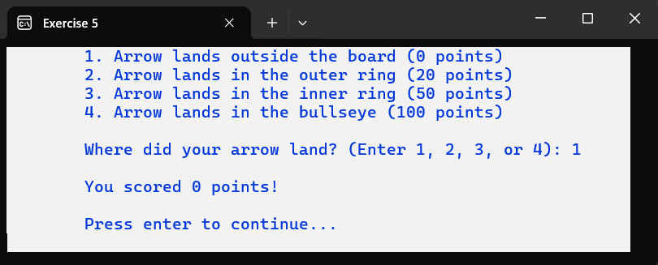

### Situation 2:

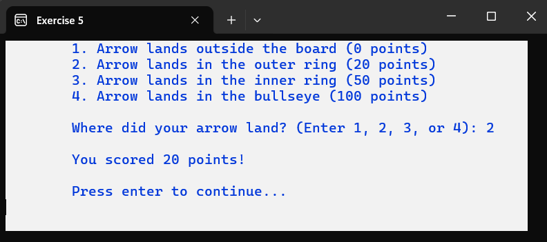

### Situation 3:

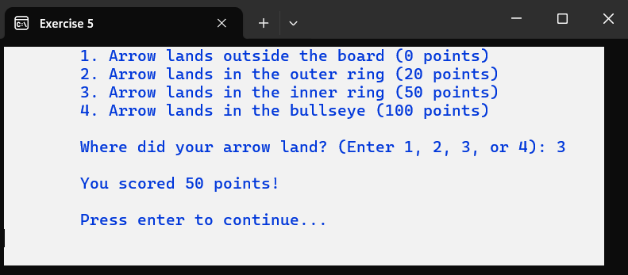

### Situation 4:

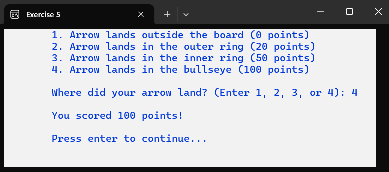

## Exercise 6

Determine if a given year is a leap year or not. The following rules apply:
- For years before 1582, a year is a leap year if it is divisible by 4.
- For years after 1582, the following rules apply (only the first applicable condition is used):
  - Divisible by 4000: Not a leap year
  - Divisible by 400: Leap year
  - Divisible by 100: Not a leap year
  - Divisible by 4: Leap year

### Situation 1:

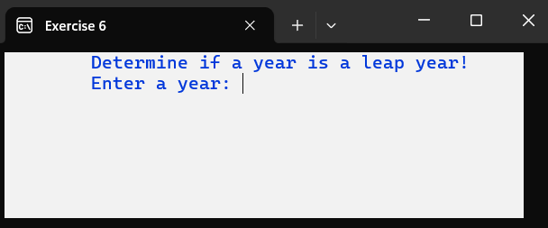
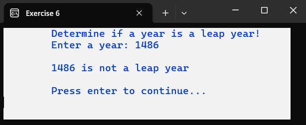

### Other Examples:

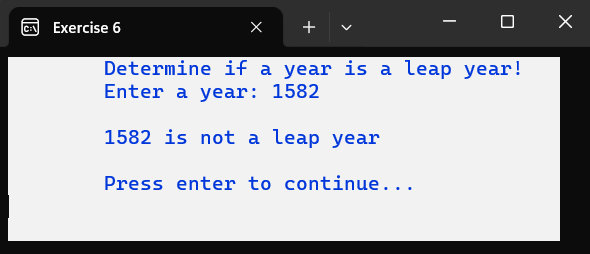
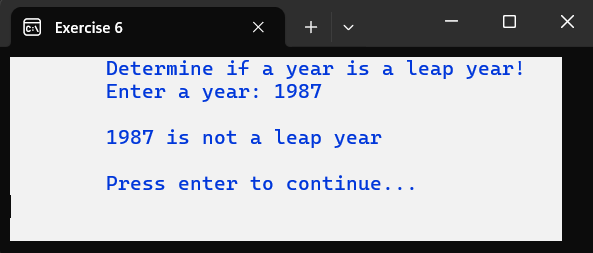
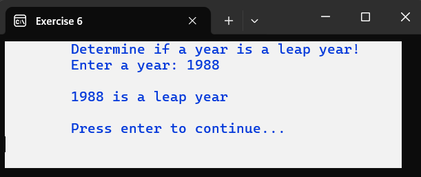
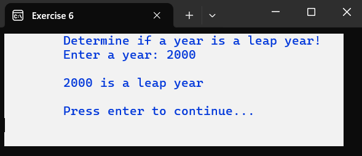

## Exercise 7

Read four numbers and print the smallest one.   
Try to solve this efficiently.  
It should be easy to add a fifth number later and still print the smallest number.

### Situation 1:

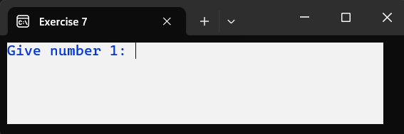
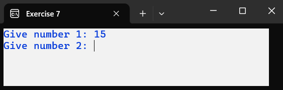
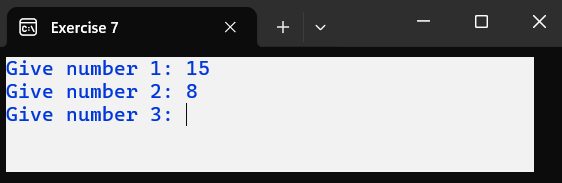
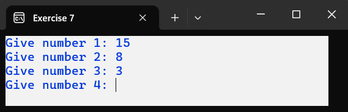
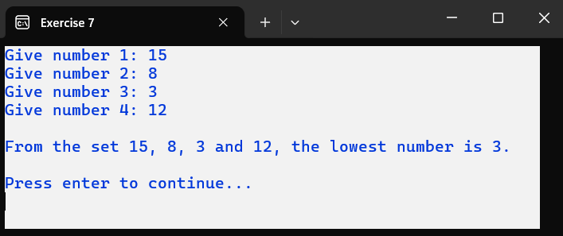

### Situation 2:

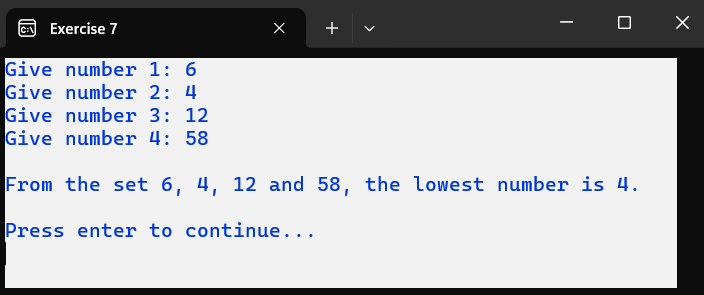

## Exercise 8

The user should input their motto and choose screen colors for it.  
They can select from background colors blue (B or b), red (R or r), and yellow (G or g).    
For text colors, they can choose from dark green (D or d), white (W or w), or cyan (C or c).    
If the user chooses an incorrect color, no color is adjusted (background remains white, and text color remains dark blue).     
After entering the necessary information, the motto should be displayed on a cleared screen in uppercase and in the chosen colors.

### Situation 1:

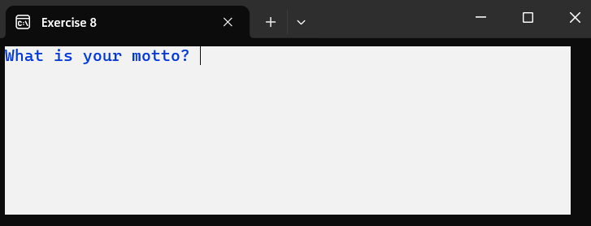
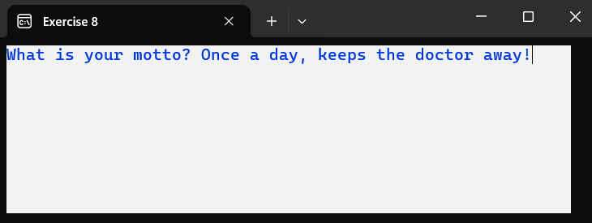
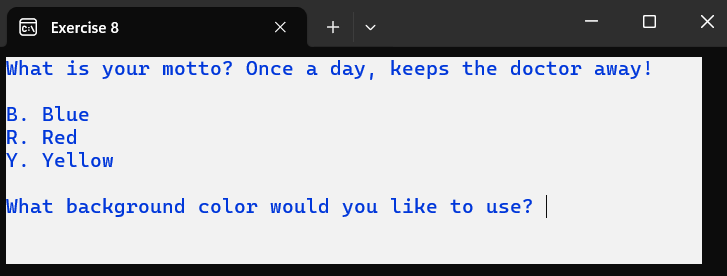
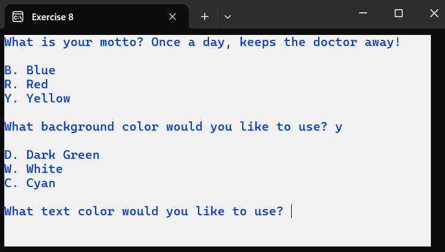
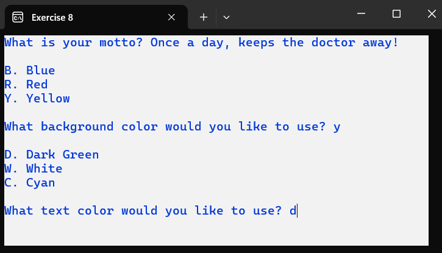
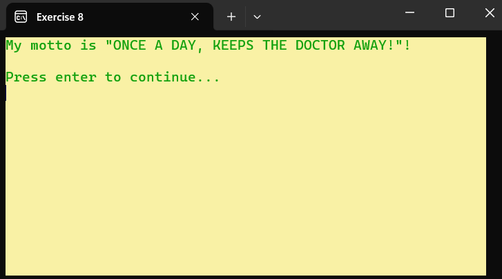

**Other Examples:**

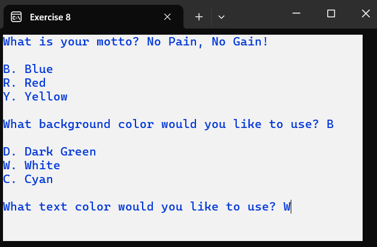
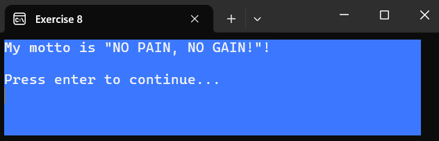
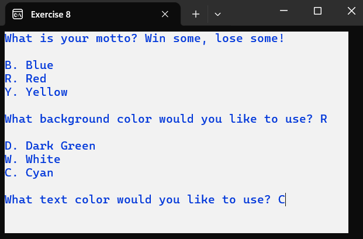

## Exercise 9

Read three numbers and a code. 
- If the code is 'A' or 'a', calculate the sum of the three numbers.
- If the code is 'B' or 'b', calculate the product of the first number and the third number.
- If the code is 'C' or 'c', calculate the difference between the third number and the second number.
- If the code is 'D' or 'd', calculate the square root of the first number if it is greater than zero. Otherwise, print the message "Sorry, we do not calculate square roots of negative numbers or zero!".
- In all other cases, determine the largest number among the three entered numbers.

### Situation 1:

### Situation 2:

### Situation 3:

### Situation 4:

### Situation 5:

### Situation 6:

### Situation 7:

## Exercise 10

Many people have one or more hobbies.   
For each hobby, you can buy a magazine.     
The program will ask for the user's first name and last name.   
The user can then choose from a list of hobbies.    
The program will determine which magazine the user should purchase based on their chosen hobby.     
If the user makes a choice that is not in the list, they receive no suggestion.
Review the examples carefully.

**Current Hobby List:**

| Hobby                   | Magazine            |
|-------------------------|----------------------|
| 1. Handcraft (knitting, crocheting, etc.) | Anna                 |
| 2. Making clothing      | Snippie              |
| 3. Decorating the interior  | Living etc.              |
| 4. Soccer               | Football International |
| 5. Riding a bike        | Hiking & Biking   |
| 6. Photography          | Zoom EN              |
| 7. Running              | Runners              |

### Situation 1:

**Note:** The first name is displayed in lowercase and the last name in uppercase. The suggestion is printed in blue text on a yellow background. Before and after the suggestion, three extra blank lines are printed. This is accomplished with a single `Console.WriteLine()` instruction.

**Additional Examples:**

