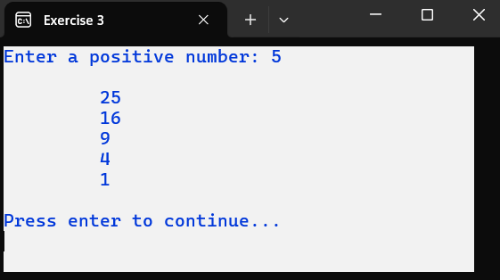
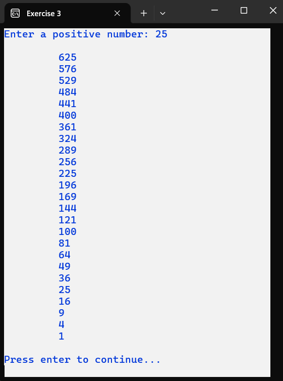

# C# Iteration For Exercises

## Exercise 1

Write a program that calculates the sum of 10 numbers.	
The numbers are entered via the keyboard.	
The result is printed on the screen.	
Of course, in the future, it might be that we want to determine the sum of 20 or just 5 numbers.

## Exercise 2

Write a program that reads the user's name and their lucky number.	
Now print the lucky number followed by the name entered, repeated a number of times determined by the lucky number.

### Situation 1:

### Situation 2:

## Exercise 3

Write a program that displays an overview of squares on the screen.	
The user enters a number, then the square of that number is shown, followed by the square of the number decreased by 1, and so on... until you end with the square of 1.

### Situation 1:

### Situation 2:

## Exercise 4

This program should print a supporter scarf.	
This scarf consists of 2 symbols, and the user will decide which symbols to use.	
After entering the symbols, the user can also specify how long and how wide their scarf should be.	
Pay close attention to the examples.

### Situation 1:

### Situation 2:

## Exercise 5

The user enters 2 numbers.	
We assume that the first number is greater than the second number.	
Display all the numbers that lie between the first number and the second number.

### Situation 1:

### Situation 2:

### Situation 3:

## Exercise 6

The user must enter two different numbers.	
Print all the even numbers that lie between these two entered numbers.

### Situation 1:

### Situation 2:

### Situation 3:

### Situation 4:

