# C# Iteration Do While Exercises

## General:

From now on, we need to validate all input information. If there is an error, the user gets another chance to enter the information.

## Exercise 1

This exercise is an extension of '2 Selection Exercise 1'.
Enter 2 numbers. The goal is to calculate the difference, but always subtract the smaller number from the larger one.
Extension: We now validate the entered values. Only whole numbers are accepted.

### Situation 1

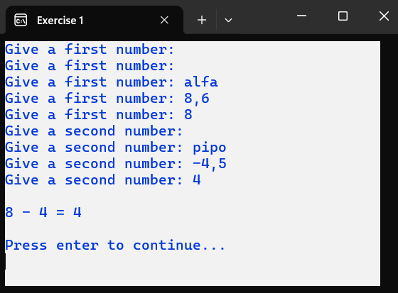

### Situation 2

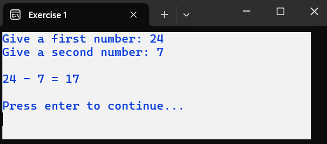

### Situation 3

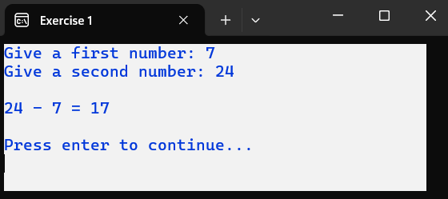

## Exercise 2

Create a program that reads the price excluding VAT and the VAT percentage for 5 items. The price including VAT is calculated and printed for each item.
The price excluding VAT must be greater than 0.00. The VAT percentage cannot be negative and can contain decimals.

Used colors: The title related to the item is printed in magenta.

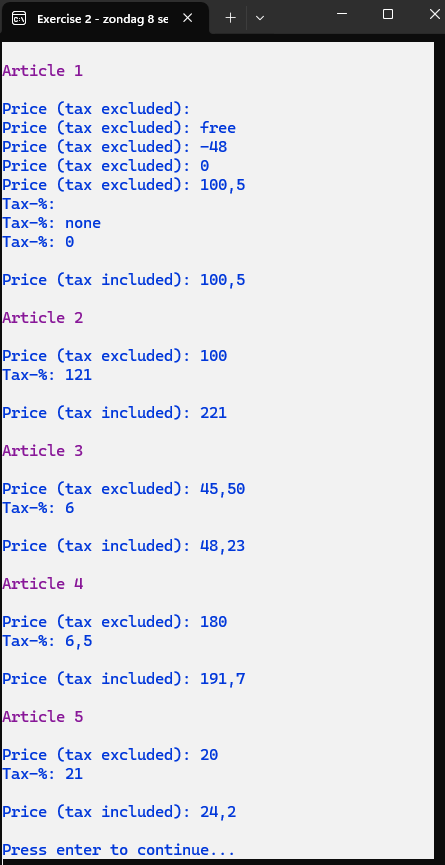

## Exercise 3

For 4 people, we read the first name, last name, and date of birth. The age group is determined based on the date of birth. Study the table below carefully. The first and last names must be provided. The date of birth must be a valid date. Future dates of birth are not accepted.
Tip: Determine the age by subtracting the birth year from the current year.

| Minimum Age | Age Group    |
|-------------|--------------|
| 18          | Adult        |
| 10          | Teenager     |
| 3           | Toddler      |
| 0           | Baby         |

It should be easy to enter this information for 10 people.
Used colors:
- When asking for the date of birth, the first and last names are printed in red on the screen.
- The age group is printed in dark green on the screen.

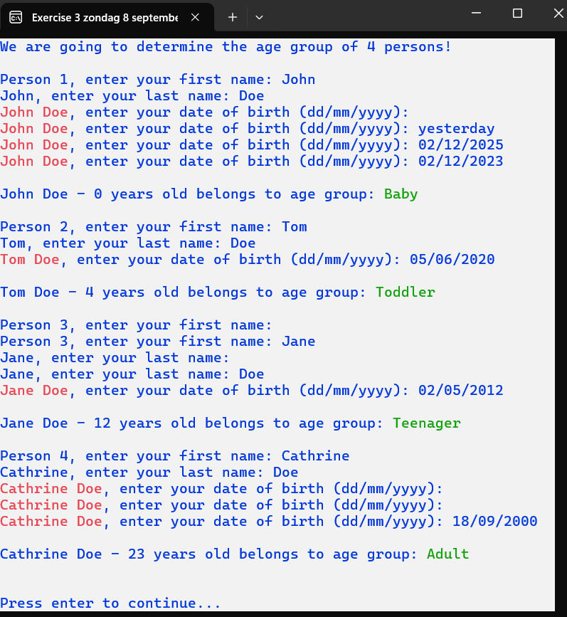

## Exercise 4

The user sees a sentence: ‘On the chair lies a sun hat and gingerbread.’ The goal is for them to study this sentence. After studying, they get the chance to reproduce the sentence. Some users will enter the sentence correctly immediately, while others will need several attempts.
Note that the sentence can be easily modified by the programmer and the program will still function correctly.

Used colors:
- The result ‘You have … to reproduce!’ is printed in green.

Note:
- If correct immediately, write ‘attempt’. In other cases, write ‘attempts’. Do this efficiently.

### Screen 1: Display the sentence

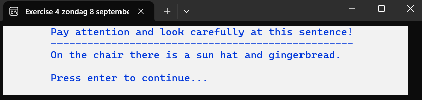

### Situation 1: Correct immediately

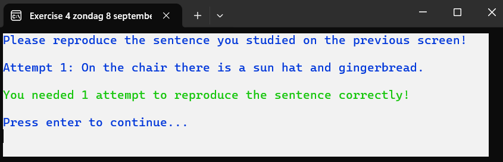

### Situation 2: After a few attempts

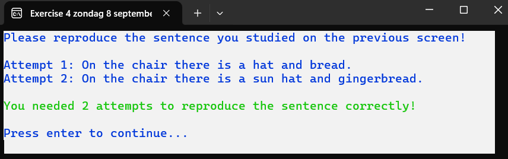

## Exercise 5

This exercise is an extension of '2 Selection Exercise 5'.
Calculate the points after throwing 3 darts at a dartboard. Check where the dart lands and calculate the corresponding points. After throwing all the darts, print the total number of points.
Outside the bullseye: 0 points – landing place = 1
Outer ring: 20 points – landing place = 2
Inner ring: 50 points – landing place = 3
In the center: 100 points – landing place = 4

**Program efficiently.** Remember that the number of darts may vary. Use the following string variable to print the points distribution and do so on a clean screen. Print the title of which dart is being thrown.

### Examples of invalid input:

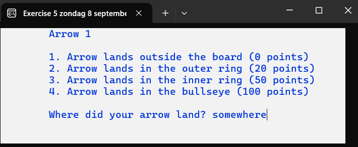
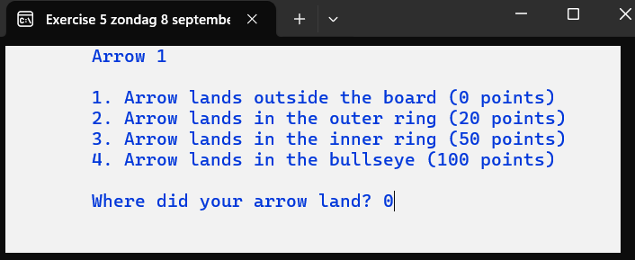
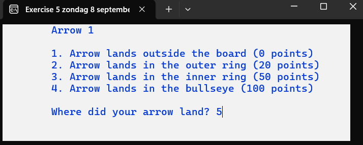

### Examples of valid input (number of darts = 3):

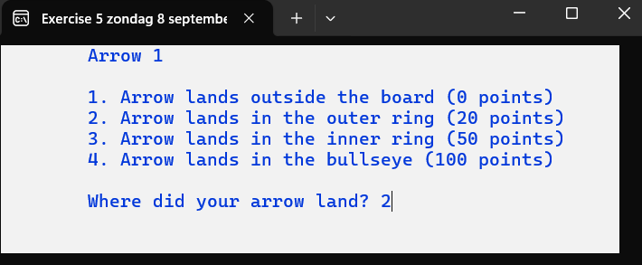
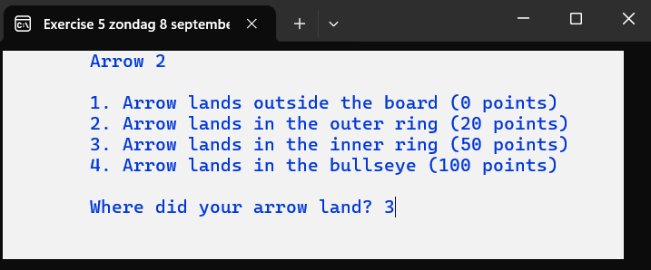
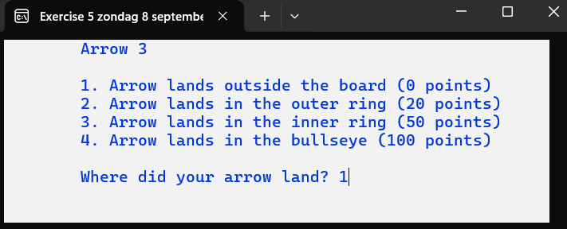
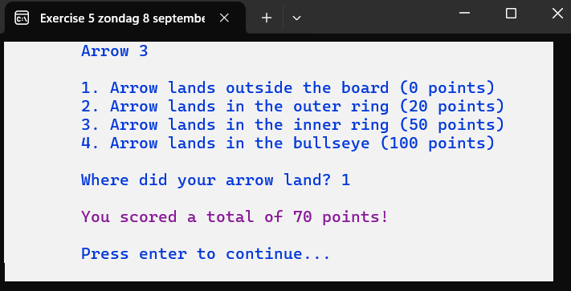

Used color: Magenta for the result.

### Examples of valid input (number of darts = 2):

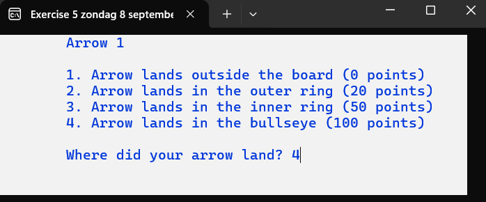
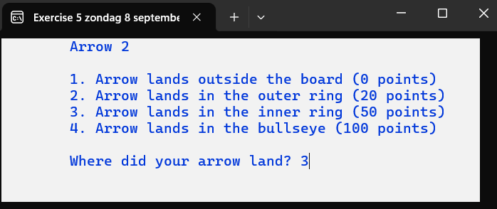
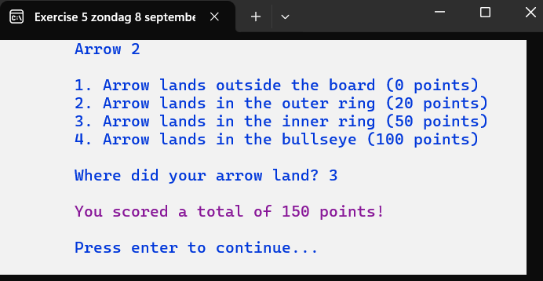

## Exercise 6

The user must provide a minimum value and a maximum value. Both values must be whole numbers, and the maximum value must be greater than the minimum value.
Let the computer randomly pick a number 3 times, which lies between the provided minimum and maximum values (inclusive).
The user then guesses which random number the computer has chosen. As a conclusion, display how many attempts the user needed.
Study the images carefully!

### Situation 1

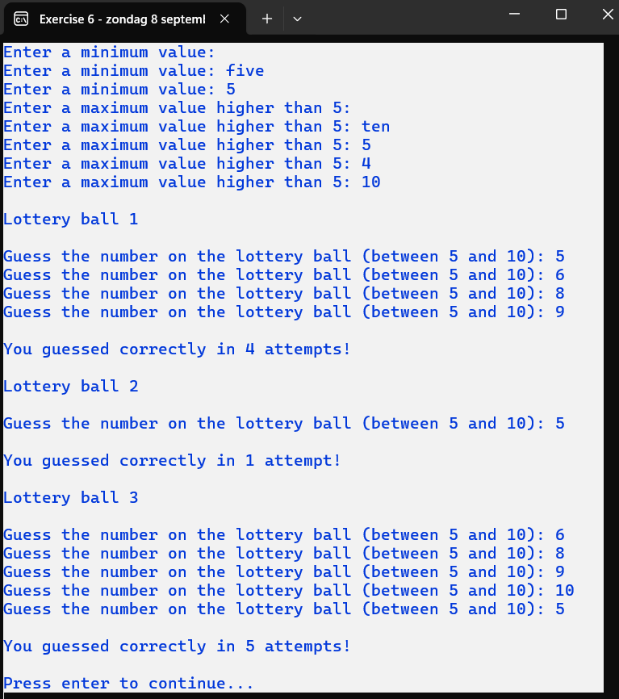

### Situation 2

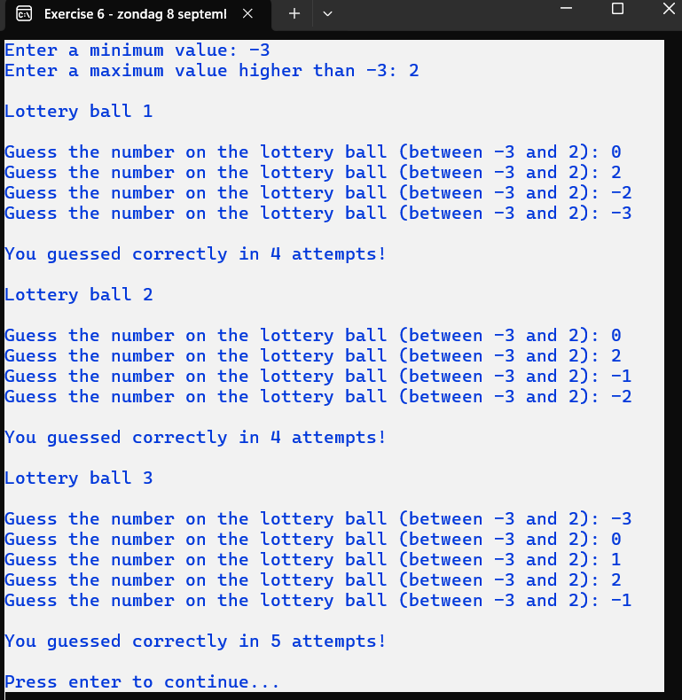