# C# Iteration While Do Exercises

## Exercise 1
Some people have no, one, or multiple friends. Write a program to print an overview of your circle of friends.

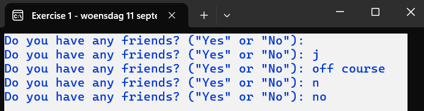

The question ‘Do you have any friends? “Yes” or “No”’ should only be answered with ‘Yes’ or ‘No’. Other answers will prompt the user to try again.

1. If the user immediately answers ‘No’, the following result is shown:

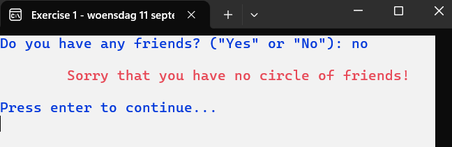

The message ‘Sorry that you have no circle of friends!’ is printed in red. After pressing enter, the program closes.

2. If the user answers ‘Yes’, they will have the chance to enter a first name.

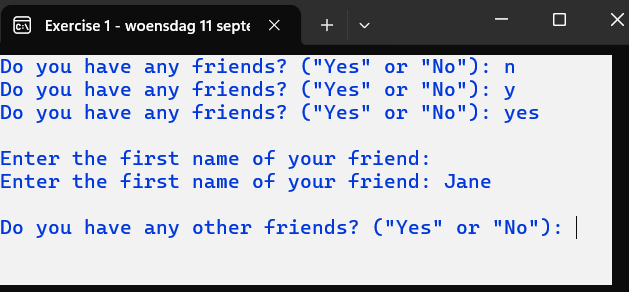

Nothing or only spaces are not accepted as a first name. In that case, the user will be prompted again to enter a valid first name. 

A valid first name will be added to the circle of friends, which will be printed later (see further). 

A new question appears (note: the question is different).


3. If the user answers ‘No’ to the next question and only one friend has been entered:

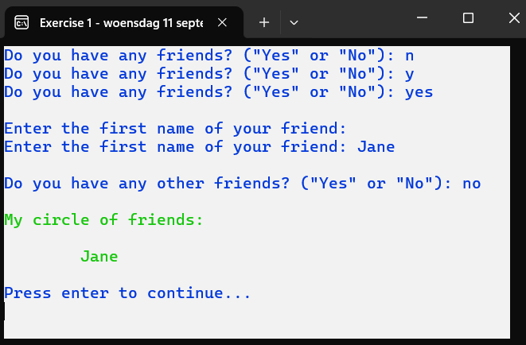

The circle of friends is shown in green on the screen. After pressing enter, the program closes.

4. If the user answers ‘No’ to the next question and multiple friends have already been entered:

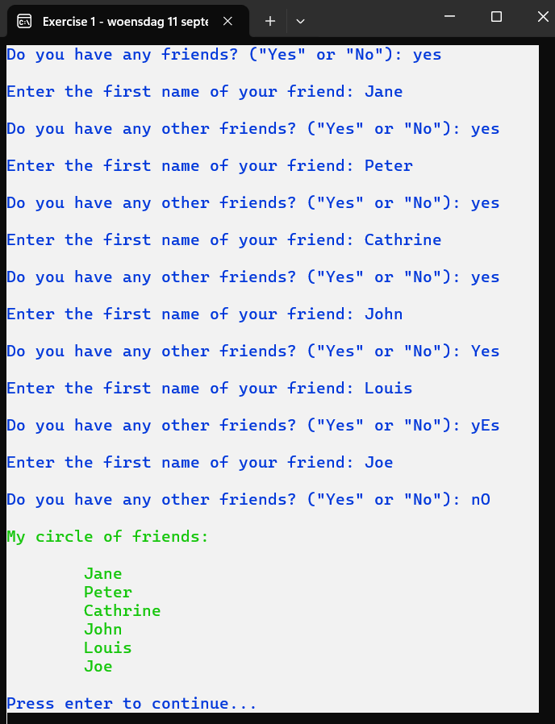

## Exercise 2
Write a program that gives the user advice about purchasing a magazine. This program is an adaptation of the program created in the chapter ‘2 Selection’.

Many people have no, one, or multiple hobbies. For each hobby, you can buy a magazine.

Suggestion list of hobbies:

| Hobby                           | Magazine              |
|----------------------------------|-----------------------|
| 1. Handicrafts (knitting, etc.)  | Anna                  |
| 2. Making clothes                | Snippie               |
| 3. Interior design               | Living etc.               |
| 4. Soccer                        | Football International |
| 5. Cycling                       | Hiking & Cycling    |
| 6. Photography                   | Zoom EN               |
| 7. Running                       | Runners               |

When entering the last name and first name, the user must provide valid data.

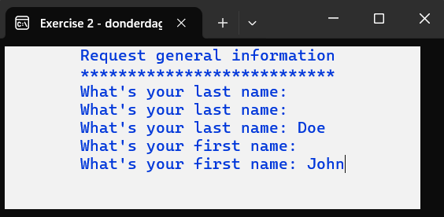

For underlining the title, no iteration is used. After correctly entering the last name and first name, the user will see the following screen:

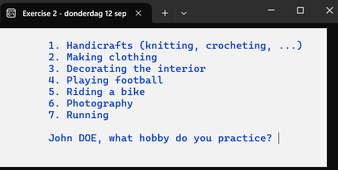

The menu has been expanded compared to ‘Exercise 10 Selection’. The last option, number 8, allows the program to stop. The original first name and last name in uppercase are displayed in the prompt. 

To reduce writing instructions when displaying the menu, you can use the following string variable:

```csharp
string overview = 
  "\t1. Handicrafts (knitting, etc.)\n" +
  "\t2. Making clothes \n" +
  "\t3. Interior design \n" +
  "\t4. Soccer \n" +
  "\t5. Cycling \n" +
  "\t6. Photography \n" +
  "\t7. Running\n" +
  "\t8. None";
```

Only a choice between 1 and 8 is accepted. If an invalid choice is made, the menu is displayed again on a clean screen.

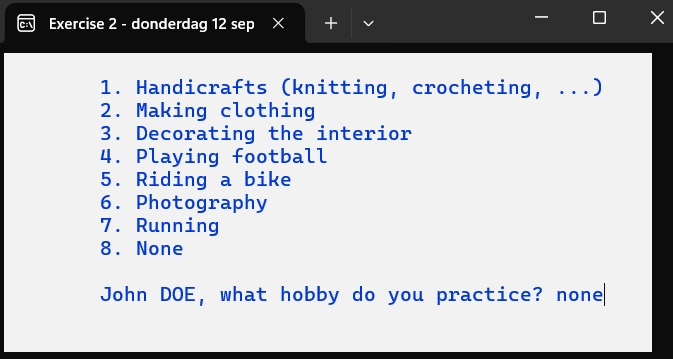

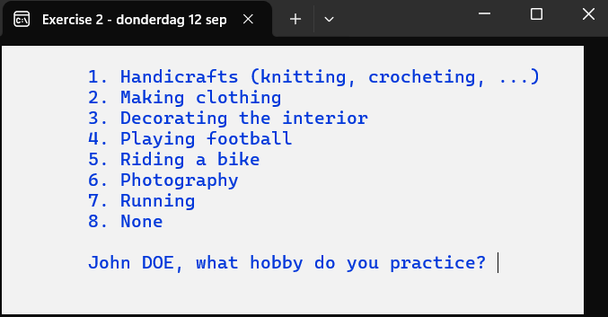

If choice 8:

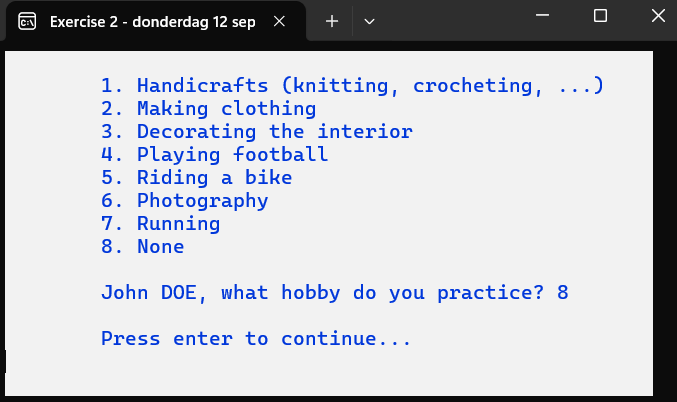


The user must press enter before the program is closed. 
If choice 1 through 7: Depending on the choice, a different suggestion is shown.

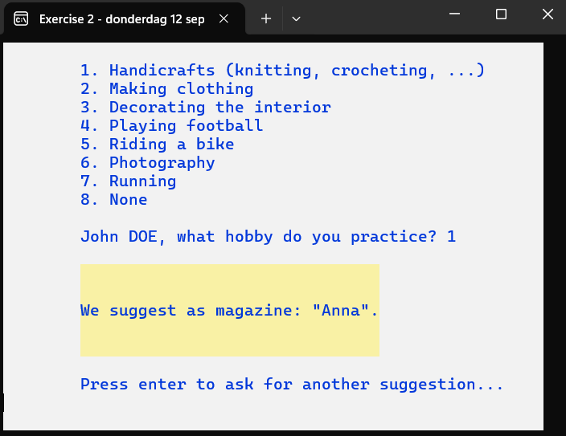

The suggestion is printed with blue letters on a yellow background instead of dark blue letters on a white background.

### Examples:

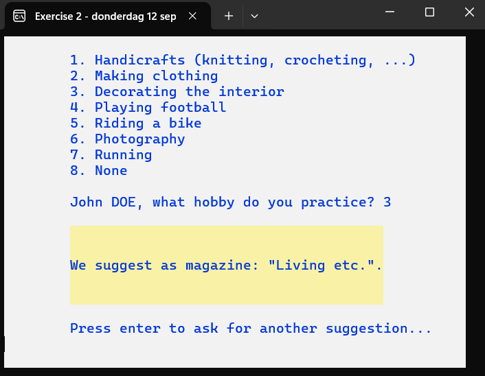


## Exercise 3 (adapted version of Exercise 4 – 3 Iteration For)
Almost every sports team releases a supporter’s scarf. Our scarves consist of two different symbols, each made of one character. The minimum length of a scarf is 4 knitting needles. The minimum width of a scarf is half the entered length. A scarf that is 6 needles long is at least 3 stitches wide.

We can now create and display supporter scarves for no, one, or several teams. The team name must consist of at least 5 characters (later, we can easily change this requirement to 3 characters, for example).

When the program starts, the following screen is displayed:

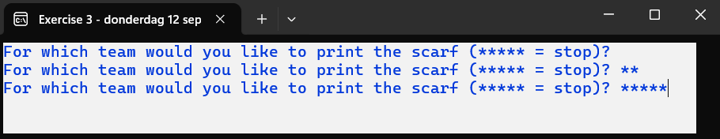

In the above example, we indicate that we do not want to handle any supporter scarves.

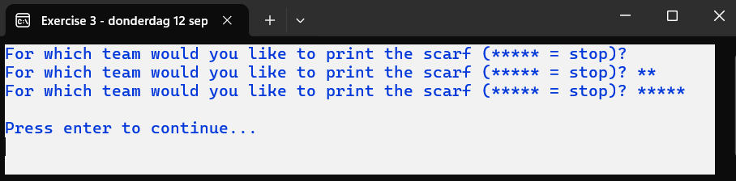

After pressing enter, the program closes. Another example:

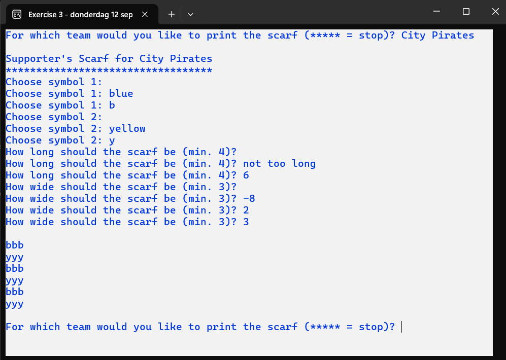

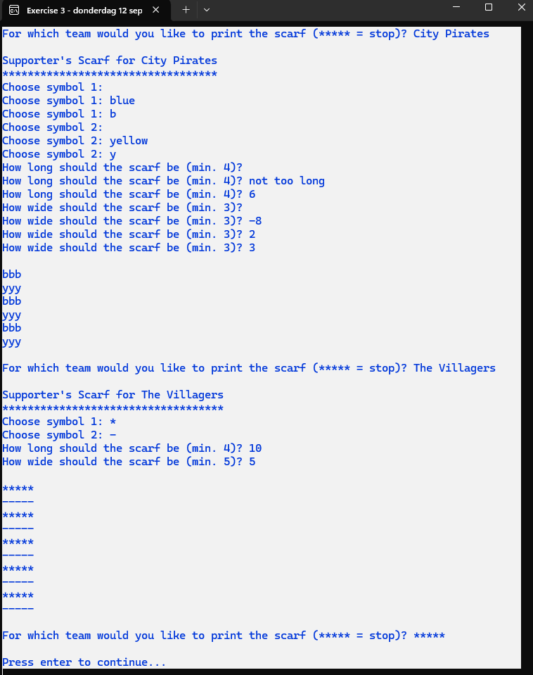

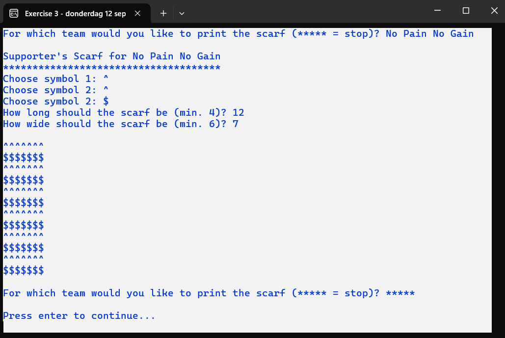

Study the images above carefully.