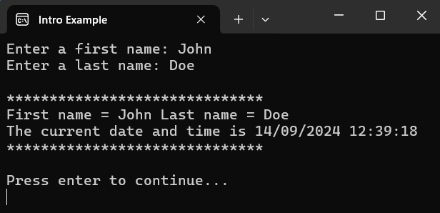
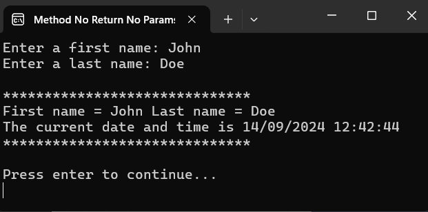
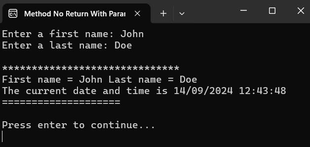
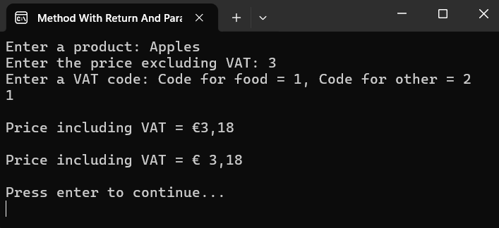
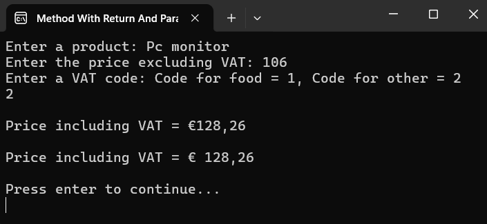
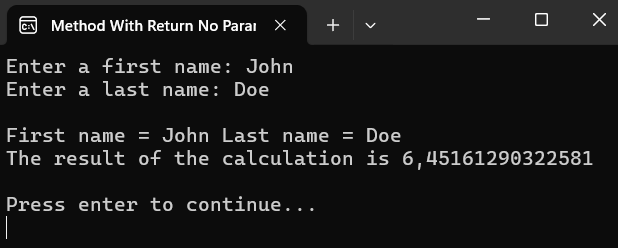
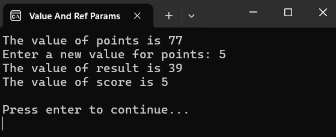
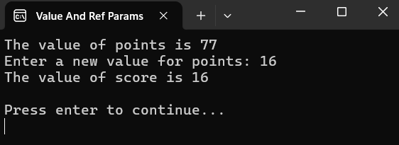
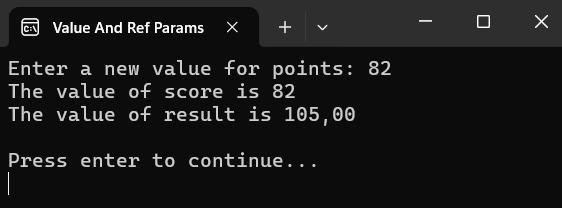

# C# Methods Examples

## Intro Example

### Method No Return No Params

### Method No Return With Params

### Method With Return And Params

#### Situation 1

#### Situation 2

### Method With Return No Params

## Value And Ref Params

### Example 1

### Example 2

### Example 3

