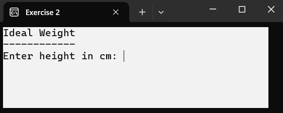

# C# Methods Exercises Extra

## Exercise 1

In this application, you will prompt for a first name, a last name, and a number. Then, you will display the desired number of labels, followed by a key press.


### 1. Mandatory Method

You need to implement this method first.

#### a. Method: `Print`

As shown in the screenshots, text is printed in varying colors, sometimes in uppercase and other times not. Programming all the lines directly in the main program would result in a lot of duplicated code, so first, you need to write a method with 3 parameters and no return value.

```csharp
private static void Print(string text, ConsoleColor foreground, string size) {}
```

You first specify the text you want to print, followed by a console color you want to use as the foreground color. Lastly, you indicate whether the text should be printed in uppercase. The method handles printing the text in the desired color and typography.

If the parameter `size` contains the text 'upper' (in any combination of uppercase and lowercase), the text should be converted to uppercase.

A few examples of correct method calls:
```csharp
Print("teacher", ConsoleColor.Red, "uppeR");
Print("welcome", ConsoleColor.Red, "upper");
Print("welcome", ConsoleColor.Red, "lowercase");
Print("welcome", ConsoleColor.Red, "<");
```

The first 2 examples will print the labels in uppercase. Implement this method first, and then write the main program.


### 2. Main Program

First, display the title ‘Printing Labels’ in red and uppercase. Next, prompt the user in blue for the first name and last name without converting them to uppercase. Then, ask for the number of labels in uppercase. You do not need to implement input validation for the first name and last name, assuming the user enters correct values. However, you must implement input validation for the number of labels, ensuring it is an integer. Keep asking until you receive a valid integer.


Once you have the number of labels, start printing them. The 1st, 3rd, etc., labels should be printed in black, showing the last name followed by the first name in the original case as entered. Every 2nd, 4th, etc., label should be printed in red and uppercase.

After the labels are printed, display ‘Press any key’ in blue on the screen. When the user presses Enter, the application should close.

Program efficiently, and make use of the method you developed first.

## Exercise 2

With this application, you can calculate your ideal weight.

Initially, you will see:


Then, a cleared screen will appear:


This assignment is divided into two parts: first, we'll work on mandatory methods, and then we will develop the main program.

### 1. Mandatory Methods

You need to implement these methods first.

#### a. Method: `PrintLine`

The method with no return value, `PrintLine()`, prints a line of a specified number of characters. The number and the character are provided as input parameters to the method call.

```csharp
private static void PrintLine(int count, string character) {}
```

After the line is printed, the cursor moves to the next line.

#### b. Method: `ScreenColors`

The method with no return value, `ScreenColors()`, sets the foreground color, background color, and clears the screen. The desired colors are provided as input parameters to the method call.

```csharp
private static void ScreenColors(ConsoleColor foreground, ConsoleColor background) {}
```

#### c. Method: `IdealWeight`

The method with a return value, `IdealWeight()`, calculates the ideal weight based on height and wrist measurement.

```csharp
private static double IdealWeight(double height, int wrist) {}
```

```text
weight = (height - 100 + 4 * wrist) / 2
```

The result is rounded to one decimal place and returned to the calling program.

### 2. Main Program

When the program starts, you will see a white screen with black text:



First, display the title ‘Ideal Weight’, underlined with 12 hyphens. Then, prompt for the height. You do not need to implement input validation, assuming the user enters correct values.


Next, read the wrist circumference without checking if the value is correct. After entering the wrist circumference, proceed to a cleared screen with a white background and blue text.


First, display the title underlined with 6 asterisks. Then, show the calculated ideal weight. After pressing Enter, the application should close.

Program efficiently and use your custom methods when developing the main program.

## Exercise 3

With this application, you can calculate the final score on your report card.

This assignment is divided into two parts: first, we'll develop the mandatory methods, and then we'll work on the main program.

### 1. Mandatory Methods

You need to implement these methods first.

#### a. Method: `ReadSubject`

```csharp
private static void ReadSubject(int subjectNumber, ref string subjectName, ref double subjectScore) {}
```

This method has 3 parameters:

- `subjectNumber`: The number of the subject for which scores need to be entered.
- `subjectName`: The name of the subject, which the user provides.
- `subjectScore`: The score of the subject, which the user provides.

In this method, prompt for the subject name. The prompt should continue until the user inputs a value.


Once the user has entered a subject name, prompt for the score.
Continue prompting until the user enters a number greater than or equal to 0 and less than or equal to 20.


#### b. Method: `Process`

```csharp
private static void Process(string subjectName, double subjectScore) {}
```

This method has 2 parameters:

- `subjectName`: The name of the subject that the user has provided (see `ReadSubject` method).
- `subjectScore`: The score of the subject that the user has provided (see `ReadSubject` method).

In this method, process the data as follows:


- Set the console text color to blue.
- Provide 10 spaces followed by the subject name in lowercase.
- Provide 10 spaces and the subject score on a scale of 20.
- Provide 10 spaces and the text 'this is' followed by the calculated percentage.
	- If the subject score is less than 10, display the percentage in red.
	- If the score is 10 or greater, display the percentage in green.
- Finally, reset the text color to white.


### 2. Main Program
When the application starts, you should see the following result:


In the main program, ensure that the user inputs 5 subjects and their corresponding scores.

Use the `ReadSubject` method to input the subject and score, and use the Process method to process the entered data.

Then, print the overall final percentage from the main program.

