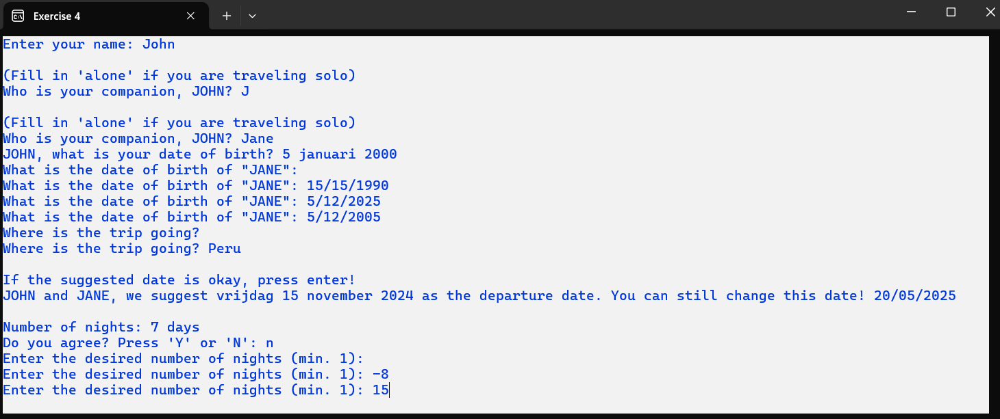
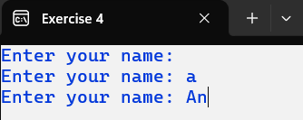
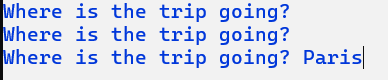

# C# Methods Exercises

In the first 3 exercises, we will optimize existing exercises.

**General rule:**
- Your method definition must adhere to the provided method definition.
- A method can contain a maximum of 20 instructions. If your method contains more instructions, you may add new methods that comply with our guidelines.
- Take the necessary steps to avoid duplicate code.

## Exercise 1 (Example 2 – 5 Iteration While Do)

**Method definitions that must be present:**

```csharp
private static void AdjustScreenColors() {}
```
```csharp
private static void PrintTitle() {}
```
```csharp
private static string ReadActivity(string question) {}
```
```csharp
private static DateTime ReadDateTime(string activity) {}
```
```csharp
private static bool IsAvailable(DateTime dateAndHourActivity) {}
```
```csharp
private static string ReadPerson() {}
```
```csharp
private static string DetermineResponse(string name, bool isAvailable) {}
```
```csharp
private static void PressEnter() {}
```

## Exercise 2 (Exercise 2 – 5 Iteration While Do)

1. AdjustScreenColors()

```csharp
private static void AdjustScreenColors() {}
```

This method ensures that:
- The screen has a white background color.
- The text color is set to dark blue.
- The screen title is updated to "Exercise 2".


2. PrintTitle()

```csharp
private static void PrintTitle() {}
```


This method ensures that the title is displayed on the screen with an underline.

3. ReadName(string question)

```csharp
private static string ReadName(string question) {}
```

This method with a return value ensures that a valid name is returned to the main program (`Main()`).
The user is given another chance to enter their name if they provide nothing or only spaces. The question to prompt the user is provided via the input parameter `question`.


4. ReadChoice(string question)

```csharp
private static int ReadChoice(string question) {}
```

This method with a return value ensures that a valid choice is returned to the main program (`Main()`). The choice must be an integer between 1 and 8 (inclusive). The user is given a proper screen with the available options and another chance to enter their choice if they make an invalid input.


5. DetermineSuggestion(int choice)

```csharp
private static string DetermineSuggestion(int choice) {}
```

This method with a return value determines which magazine suggestion is sent back to the main program (`Main()`) based on the input parameter `choice`. The return value contains the fixed text "We suggest the magazine 'xxx'." where `xxx` depends on the input parameter `choice`.


Suggestion list of hobbies:

| Hobby                           | Magazine              |
|----------------------------------|-----------------------|
| 1. Handicrafts (knitting, etc.)  | Anna                  |
| 2. Making clothes                | Snippie               |
| 3. Interior design               | Living etc.               |
| 4. Soccer                        | Football International |
| 5. Cycling                       | Hiking & Cycling    |
| 6. Photography                   | Zoom EN               |
| 7. Running                       | Runners               |


6. PrintSuggestion(string suggestion)

```csharp
private static void PrintSuggestion(string suggestion) {}
```

This method without a return value ensures that the input parameter `suggestion` is printed on the screen. The background color is yellow and the text color is blue for two lines before and after the suggestion.


7. PressEnter(string message)

```csharp
private static void PressEnter(string message) {}
```

This method without a return value prints the specified message on the screen. The user is given the opportunity to press Enter.


All methods are now implemented. Adjust the main program to use these methods correctly.

### Situation 1

Scenario: Jane Doe has no hobbies.


### Situation 2

Scenario: Jane Doe has only 1 hobby.


### Situation 3

Scenario: John Doe has multiple hobby.


## Exercise 3 (Exercise 3 – 5 Iteration While Do)

1. AdjustScreenColors()

```csharp
private static void AdjustScreenColors() {}
```

This method ensures that:
- The screen has a white background color.
- The text color is set to dark blue.
- The screen title is updated to "Exercise 3".


2. ReadName(string question, int length)

```csharp
private static string ReadName(string question, int length) {}
```

This method with a return value uses two input parameters: `question` and `length`. The method ensures that the user enters a valid name consisting of at least `x` characters, where `x` is determined by the `length` parameter.


3. PressEnter()

```csharp
private static void PressEnter() {}
```

This method has the same functionality as in Exercise 1.

4. PrintTitle(string name)

```csharp
private static void PrintTitle(string name) {}
```

This method without a return value prints the title on the screen. The title consists of the text "Supporters' Scarf" followed by the name of the team.


5. ReadSymbol(string question, string comparingSymbol)

```csharp
private static string ReadSymbol(string question, string comparingSymbol) {}
```

This method with a return value ensures that the user has the opportunity to enter a symbol. The entered symbol must consist of at least 1 character and cannot be a space. The entered symbol must also be different from the symbol provided in the input parameter `comparingSymbol`.


6. ReadNumber(string questionPart, int minimumValue)

```csharp
private static int ReadNumber(string questionPart, int minimumValue) {}
```

This method with a return value has two input parameters: `questionPart` and `minimumValue`. This method allows the user to enter an integer that is greater than the specified `minimumValue`. The question that is asked consists of three parts: the content of the `questionPart` parameter, the fixed text " must the scarf be (min. Xxx)?", where `Xxx` is replaced by the specified `minimumValue`.


7. DetermineStripe(string symbol, int width)

```csharp
private static string DetermineStripe(string symbol, int width) {}
```

This method with a return value assembles one stripe of the scarf. The input parameter `width` determines how many symbols are used in the stripe.

8. PrintScarf(string symbol, int width)

```csharp
private static void PrintScarf(string stripe1, string stripe2, int length) {}
```

This method prints the desired scarf on the screen. `stripe1` and `stripe2` are alternately printed on the screen until the scarf reaches the desired length.

**Constraint:** In this method, the `Console` class is used only once.


These are some examples of supporters' scarves.

 

All methods are now implemented. Adjust the main program to use these methods correctly.

**Possible result after adjusting `Main()`:**


## Exercise 4

This program is not based on an existing application.

**Program Objective:**

The user wishes to book a trip, possibly with a companion. The program prompts for the names and birthdates of the participant(s). Next, the user can enter the travel destination. The program suggests a departure date, which is 2 months from the current date. The user can adjust this date if needed. The program also suggests 7 nights of accommodation. If the number of nights does not match the participants' preferences, the user can adjust it. The program calculates the date when the participants will return from their fantastic trip. Once all necessary information is entered, the trip details are printed on a blank screen. After printing, the program exits.

**Current date:** 15/09/2024

### Situation 1

No companion, departure date is okay, number of nights is also okay.


### Situation 2

With a companion, departure date and number of nights are adjusted.




First, implement the following method definitions before calling them in the main program (`Main()`).

**Method definitions:**

You can reuse the methods `AdjustScreenColors()` and `PressEnter()` from a previous exercise. The `Title` property is updated to "Exercise 4". The `PressEnter()` method prints the message passed in the input parameter.

1. ReadName(string question)

```csharp
private static string ReadName(string question) {}
```

The method allows the user to enter a name consisting of at least 2 characters.



2. ReadDate(string question)

```csharp
private static DateTime ReadDate(string question) {}
```

This method gives the user the opportunity to enter a valid date.

3. ReadDateOfBirth(string question)

```csharp
private static DateTime ReadDateOfBirth(string question) {}
```

This method ensures that the user can enter a valid birthdate. It calls the `ReadDate()` method to actually read the date but performs a check to ensure that the entered date can be a birthdate. We assume that the traveler is not older than 100 years.


4. AdjustDepartureDate(string question, ref DateTime date)

```csharp
private static void AdjustDepartureDate(string question, ref DateTime date) {}
```

This method allows the user to set a custom departure date. The input parameter is first printed as a message. 

If the user responds to the message by pressing Enter, the date will not be adjusted.


In the other case, it is checked whether the new date is a valid departure date. The earliest departure date is the day after the current date. 

**Example:** Current date = 15/09/2024


5. ReadNumberOfDays(string question)

```csharp
private static int ReadNumberOfDays(string question) {}
```

This method allows the user to enter a valid number of days. Negative numbers or a number equal to zero are not accepted.

6. AdjustNumberOfNights(string message, ref int numberOfDays)

```csharp
private static void AdjustNumberOfNights(string message, ref int numberOfDays) {}
```

This method gives the user the opportunity to adjust the number of nights if needed. First, the user must answer the given question (= message) with 'Y' or 'N'.


This method gives the user the opportunity to adjust the number of nights if needed. First, the user must respond to the given question (= message) with 'Y' or 'N'.


7. ReadDestination()

```csharp
private static void ReadDestination() {}
```

This method ensures that a destination is entered with at least one character.

**Info:** 



8. CalculateReturnDate(DateTime date, int numberOfDays)

```csharp
private static DateTime CalculateReturnDate(DateTime date, int numberOfDays) {}
```

This method calculates the return date. Return date = date + numberOfDays.

9. PrintTravelInformation(string participant1, string participant2, DateTime dateOfBirthParticipant1, DateTime dateOfBirthParticipant2, string destination, DateTime departureDate, DateTime returnDate)

```csharp
private static void PrintTravelInformation(string participant1, string participant2, DateTime dateOfBirthParticipant1, DateTime dateOfBirthParticipant2, string destination, DateTime departureDate, DateTime returnDate) {}
```

**Parameters:** participant1, participant2, dateOfBirthParticipant1, dateOfBirthParticipant2, destination, departureDate, returnDate.

This method, which does not return a value, uses various input parameters to print the travel information on a clean screen.


For the companion's information, 16 spaces are printed.

All methods are now detailed. Use these methods to achieve the program's goal.

## Exercise 5 and beyond…

Adjust all previous exercises from earlier chapters so that the main program meets the requirements outlined in this chapter.
