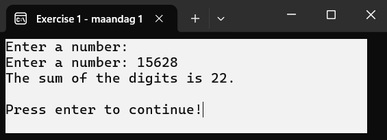
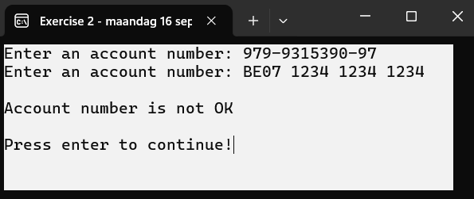
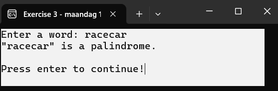
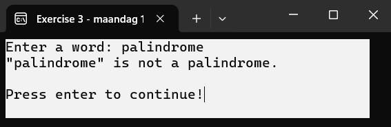
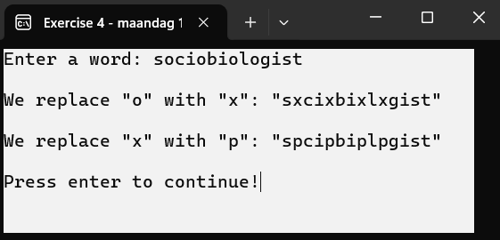
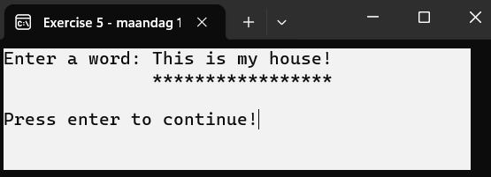
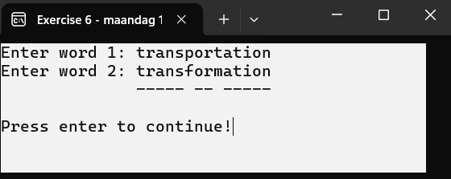
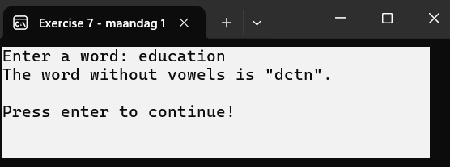

# C# String Functions Exercises

## Exercise 1
Write a program that prints the sum of the digits of a given number.

## Exercise 2
A bank account number consists of 3 groups of digits.  
Example: BExx 1234 1234 1234  
Write a program that checks whether a given bank account number is correct.  
A given number is correct if, when dividing the number formed by the first 10 digits by 97, the remainder equals the last 2 digits of the account number. If the remainder is 00, the control number is 97. Example: 979-9315390-97

## Exercise 3
A user enters a word. You check if the word is a palindrome.

## Exercise 4
A user enters a word. You replace all the O's with X's (in the style of Edgar Allen Poe). Do this both with and without the Replace() function.

## Exercise 5
A user enters a word. You print a line of asterisks under that word.  
You don't need to use loops.

Hint: `new String(char c, int count)` where `char` is enclosed in ' '.

## Exercise 6
A user enters two words. You underline the letters that are the same in both words.

## Exercise 7
A user enters a word. You remove all the vowels from it.

