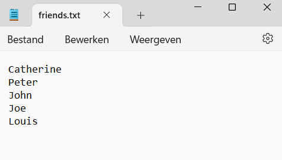
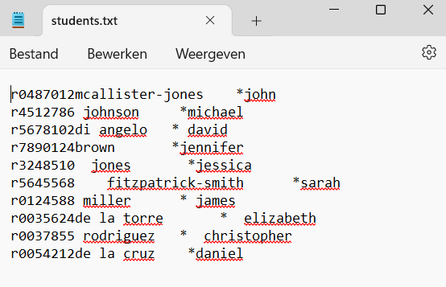
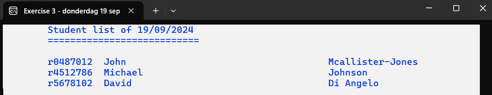
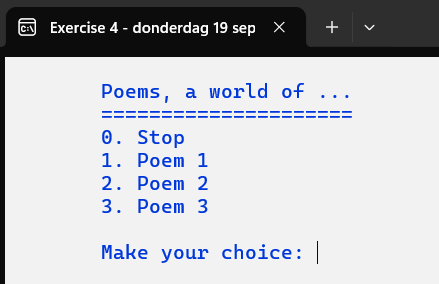

# C# Files Exercises

## General Rules
- Your method definition must comply with the given method definition.
- A method contains a maximum of 20 instructions. If your method contains more instructions, you can always add new methods that comply with our agreements.
- Do what is necessary to avoid duplicate code.

## Exercise 1
This exercise uses the files `friends0.txt` and `friends.txt`. We have already created this exercise in a previous chapter. We will now read names from a text file instead of via the keyboard.
Add the text files `friends0.txt` and `friends.txt` to your solution and ensure they are accessible to your program.
You may reuse the methods `AdjustScreenColors()` and `PressEnter()` from a previous exercise.
In the method `AdjustScreenColors()`, change the `Title` property to 'Exercise 1'.

```csharp
private static void AdjustScreenColors(string title) {}
```


Modify the method `PressEnter()` to ensure that the message is always printed in dark blue and that the message is preceded by a tab.

```csharp
private static void PressEnter() {}
```


### Program Objective:
Read the content of the specified file and print this information on the screen.
If we read an empty file, we get a red message on the screen. If the file contains records, we get an overview of all the read friends in green.
Content of `friends0.txt`:


The file exists but contains no records.

Content of `friends.txt`:

```text
Catherine
Peter
John
Joe
Louis
```



Each record consists of the first name of a friend.

### We first work out some mandatory methods:
1. `ReadFile(string filename, ref string overview)`
   This method reads all records from the specified file (see input parameter `filename`). The input-output parameter `overview` is supplemented with the name of the friend so that an overview of all read friends can be printed later.

```csharp
private static void ReadFile(string filename, ref string overview) {}
```

2. `HandleFriendsFile(string filename)`
   This method ensures that the correct printout is displayed on an empty screen. This method uses the `ReadFile()` method to read the content of the specified file and build the overview.
   
    If the input parameter `filename` refers to an empty file, we get the red message 'Sorry, you don't have a circle of friends!' on the screen.

```csharp
private static void HandleFriendsFile(string filename) {}
```


If an overview is built, this overview is displayed on the screen in green.


### The main program consists of the following instructions:


The result of this program is:


Press enter to get the next screen.


Press enter to close the program.

## Exercise 2
This exercise uses the files `supporters0.txt` and `supporters.txt`. We have already created this exercise in a previous chapter. We will now read the data to create a supporter scarf from a text file instead of via the keyboard.
Add the text files `supporters0.txt` and `supporters.txt` to your solution and ensure they are accessible to your program.

Content of `supporters0.txt`:


The file exists but contains no records.

Content of `supporters.txt`:

```text
City Pirates;b;g;6;3
The Villagers;*;-;10;5
No Pain No Gain;=;$;12;7
```


Each record consists of the following fields:
- Team name
- Symbol1
- Symbol2
- Length
- Width

Each field is separated by a semicolon.

You may reuse the methods `AdjustScreenColors()` and `PressEnter()` from a previous exercise.
In the method `AdjustScreenColors()`, change the `Title` property to 'Exercise 2'.

### Mandatory Methods:
1. **PrintNotification(string message)**

```csharp
private static void PrintNotification(string message) {}
```

   This method ensures that the message is printed on a blank screen. A tab is printed before the message.


2. **PrintTitle(string teamName)**

```csharp
private static void PrintTitle(string teamName) {}
```

   This method ensures that the title is printed on a blank screen. The title consists of 'Supporter scarf' + team name and is underlined with asterisks.
   Examples:

   

   

   


3. **PrintScarf(string stripe1, string stripe2, int length)**

```csharp
private static void PrintScarf(string symbol1, string symbol2, int length) {}
```

   This method alternately prints the contents of the input parameters `symbol1` and `symbol2` on the screen until the desired length is reached.
   Examples:

   

`symbol1 = 'bbb'`, `symbol2 = 'ggg'`, `length = 6`
   
   
   
`symbol1 = '*****'`, `symbol2 = '-----'`, `length = 10`

   Extra restriction: Only in the methods `PrintNotification()`, `PrintTitle()`, `PressEnter()`, and `PrintScarf()` may you use the methods `Console.Write()` or `Console.WriteLine()`.

4. **HandleRecord(string record)**

```csharp
private static void HandleRecord(string record) {}
```
   - This method splits a record into the different fields: team name, symbol1, symbol2, length, and width. The fields are separated by a semicolon.
   - For each record, the methods `PrintTitle()` and `PrintScarf()` are called to display the desired scarf on the screen.
   Examples:
   
   

   

   

5. **HandleFile(string filename)**

```csharp
private static void HandleFile(string filename) {}
```

   This method handles the specified file. A file can:
   - Not exist. In that case, an appropriate message '... does not exist!' is printed on the screen via the method `PrintNotification()`, followed by the option to press enter. Work efficiently!
     Example: filename = `supportersNone.txt`


   - Contain no records. In that case, an appropriate message '... contains no data!' is printed on the screen via the method `PrintNotification()`, followed by the option to press enter. Work efficiently!
     Example: filename = `supporters0.txt`
     

   
   - Contain one or more records. For each record in the specified file, the requested supporter scarf is printed. Use the methods `HandleRecord()` and `PressEnter()` to achieve this.
     Example: filename = `supporters.txt`
     


### Main Program Instructions:


### Program Result:
If the content of the last called file is not adjusted:


Press enter to close the program.

## Exercise 3
We will now read student data from a fictional class via a text file.
Add the text file `students.txt` to your solution and ensure it is accessible to your program.

Content of `students.txt`:

```text
r0487012mcallister-jones    *john
r4512786 johnson     *michael
r5678102di angelo   * david
r7890124brown       *jennifer
r3248510  jones       *jessica
r5645568    fitzpatrick-smith      *sarah
r0124588 miller      * james
r0035624de la torre       *  elizabeth
r0037855 rodriguez   *  christopher
r0054212de la cruz    *daniel
```



Each record consists of the student number (8 characters), the last name, and the first name of a student. The last name is separated from the first name by an asterisk.

You may reuse the methods `AdjustScreenColors()`, `PressEnter()`, and `PrintNotification()` from a previous exercise.
In the method `AdjustScreenColors()`, change the `Title` property to 'Exercise 3'.

### Mandatory Methods:
- **PrintTitle()**

```csharp
private static void PrintTitle() {}
```

  This method prints a title consisting of 'Student List of ', followed by the current date and an underline on a blank screen.
  Example: (current date = September 19, 2024)


- **CapitalizeCertainLetters(ref string name, string symbol)**

```csharp
private static void CapitalizeCertainLetters(ref string name, string symbol) {}
```

  This method adjusts the input-output parameter `name`. Each letter following the specified symbol is converted to an uppercase letter.
  Examples:
  - Original content: `name`, symbol = ' ' -> New content: `name`
    - john -> John
    - di angelo -> Di Angelo
    - de la torre -> De La Torre
    - de la cruz -> De La Cruz
  - Original content: `name`, symbol = '-' -> New content: `name`
    - fitzpatrick-smith -> Fitzpatrick-Smith
    - mcallister-jones -> McAllister-Jones

- **PrintStudentInfo(string number, string name, string firstName)**

```csharp
private static void PrintStudentInfo(string number, string name, string firstName) {}
```

  This method prints the information of one student in a specified format on the screen. A tab is printed before the number. The number is left-aligned and spans 10 positions. The first name is left-aligned and spans 40 positions.
  Examples:


  Extra restriction: Only in the methods `PrintNotification()`, `PrintTitle()`, `PressEnter()`, and `PrintStudentInfo()` may you use the methods `Console.Write()` or `Console.WriteLine()`.

- **HandleRecord(string record, ref bool isTitlePrinted)**

```csharp
private static void HandleRecord(string record, ref bool isTitlePrinted) {}
```

  This method first splits the input parameter `record` into different fields:
  - Student number: first 8 characters
  - Last name: from position 9 to the asterisk. Spaces before or after are not included in the variable `lastName`.
  - First name: all characters after the asterisk. Spaces before or after are not included in the variable `firstName`.
  
  After splitting, the first and last names are transformed via the method `CapitalizeCertainLetters()` so they are ready to be printed via the method `PrintStudentInfo()`. When the first record is processed, a title is printed via the method `PrintTitle()`.
  Example: after splitting the following record:


  Example: after transforming:


  Example: after using `PrintStudentInfo()`:



- **ReadFile(string filename)**

```csharp
private static void ReadFile(string filename) {}
```

  This method reads each record from the specified file. Use the method `HandleRecord()` to process the read record as described in the previous method.

- **HandleStudents(string filename)**

```csharp
private static void HandleStudents(string filename) {}
```

  This method checks if the program has access to the specified file. For an unknown or inaccessible file, a message '... does not exist!' is printed (the file name replaces '...'). Otherwise, the appropriate method is called to process the file.
  Example: `students.txt` is inaccessible or does not exist.


 
### Main Program Instructions:


### Program Result:
If the current date is September 19, 2024:


Press enter to close the program.

## Exercise 4
You may reuse the methods `AdjustScreenColors()` and `PressEnter()` from a previous exercise. In the method `AdjustScreenColors()`, change the `Title` property to 'Exercise 4'.
We will build this program in different parts.

### Part 1:
We want to print an overview of the possible choices a user can make.

#### Program Operation:


The user can now select a desired poem (choice 1 to 11) or type 0.
- If the user immediately chooses zero, the method `PressEnter()` is called. After pressing enter, the program closes.


- If the user makes another choice, they receive one of the following messages:


After displaying the message, the user can press enter after viewing the result. The menu is then shown again on a blank screen.

To achieve this, we will develop some mandatory methods.

1. **ComposeMenu(int numberOfItems)**

```csharp
private static string ComposeMenu(int numberOfItems) {}
```

   This method with a return value composes a menu, depending on the specified number of items. The choice '0. Stop' is always placed as the first item in the return string.
   
   Examples:


   `numberOfItems = 5`


   `numberOfItems = 3`

   A tab is added for each option.

   This method does not print anything on the screen. It ensures that the menu choices are built and returned.

2. **PrintTitle(string title)**

```csharp
private static void PrintTitle(string title) {}
```

   This method prints a title with an underline on a blank screen.
   
   Examples:


3. **PrintDetail(string information, bool newLine)**

```csharp
private static void PrintDetail(string information, bool newLine) {}
```

   This method prints the specified information on the screen. The input parameter `newLine` determines whether `WriteLine()` or `Write()` of the `Console` class is used.
   
   Examples:


   - `newLine = true`


   - `newLine = false`

4. **ReadChoice(string menu, int numberOfChoices)**

```csharp
private static int ReadChoice(string menu, int numberOfChoices) {}
```

   This method ensures that the user can make a choice on a blank screen that meets the displayed menu overview.



   Only a value that meets the displayed options is returned. When the user enters an incorrect value, they get a new chance. Use the methods `PrintTitle()` and `PrintDetail()` to achieve this.

Write the necessary instructions in the main program so that we can make a choice from the different options. When a correct choice is entered, we get the message 'The chosen option was ...'. (... is replaced by the chosen option). After pressing enter, the user can make a new choice or choose to stop.

Restriction: Only in the methods `PressEnter()`, `PrintDetail()`, and `PrintTitle()` may the `Write()` and `WriteLine()` instructions of the `Console` class be used. Use your newly created methods!

Example: number of menu items = 3


After pressing enter, the program closes.
Example: number of menu items = 11 (you only need to change one value and the program should now be correct)


## Part 2:
Comment out the following instruction:
`PrintDetail(information: "\n\tThe chosen option was " + choice, newLine: true);`
Import all text files from the 'Files' folder into your solution that start with the letters 'Poem'.
In PR 3 of the main program, it is now checked whether a file exists, depending on the chosen option.
- If we select a non-existent (choice = 7, 8, or 9) or inaccessible file, we receive a message. Use the appropriate self-written method for this.
  
Example:


- If we make a choice for which a file is available, we use the method `HandleFile()` to achieve the following result.


The method `HandleFile()` has no return value and only one input parameter `file`.

The method ensures that the content of the chosen poem is displayed on a blank screen.

After pressing enter, we again have the option to call up the next poem.