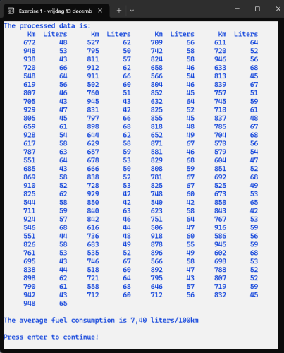
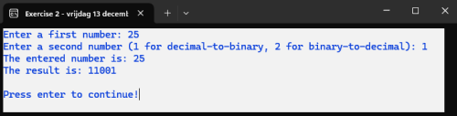
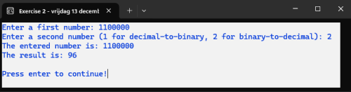

# C# Exam Example

## Exercise 1

We are creating a console application that reads data from a file named ``Consumption.txt``. This file contains data regarding a car's fuel consumption. Each entry consists of the number of kilometers driven on one line, followed by the number of liters of fuel refueled on the next line (review the structure of the provided file in Notepad).

The goal is to create a console application that produces the following output:

You must use a void method to print the data from the file. For calculating the average fuel consumption, write a method with a **return value**.

## Exercise 2

We are going to write a Console application that performs the conversion between decimal and binary, and vice versa.

#### Requirements:
1. Input must be a **positive number**.
2. A second input (1 or 2) determines the type of conversion:
   - **1** means converting from decimal to binary.
   - **2** means converting from binary to decimal.

#### Methods:
- Write a **void method** for converting from decimal to binary.
- Write a **method with a return value** for converting from binary to decimal.

---

#### Theory on how to approach the conversion:

##### **Decimal to Binary**:
For example, converting **25** to binary yields **11001**.  
Here’s how we arrive at the result:
- \( 25 \ 2 = 12.5 \) → This gives a **1** in the binary notation (starting from the end): **1**  
- \( 12 \ 2 = 6 \) → Integer division gives **0**: **01**  
- \( 6 \ 2 = 3 \) → Integer division gives **0**: **001**  
- \( 3 \ 2 = 1.5 \) → This gives a **1**: **1001**  
- \( 1 \ 2 = 0.5 \) → This gives a **1**: **11001**

We continue dividing by 2 until the integer part of the division equals 0. If the division is not whole, we add **1** to the binary notation; otherwise, we add **0**.

---

##### **Binary to Decimal**:
For example, converting **1100000** to decimal yields **96**.  
Here’s how we calculate this:
\[ (1 * 2 ^ 6) + (1 * 2 ^ 5) + (0 * 2 ^ 4) + (0 * 2 ^ 3) + (0 * 2 ^ 2) + (0 * 2 ^ 1) + (0 * 2 ^ 0) \]  

